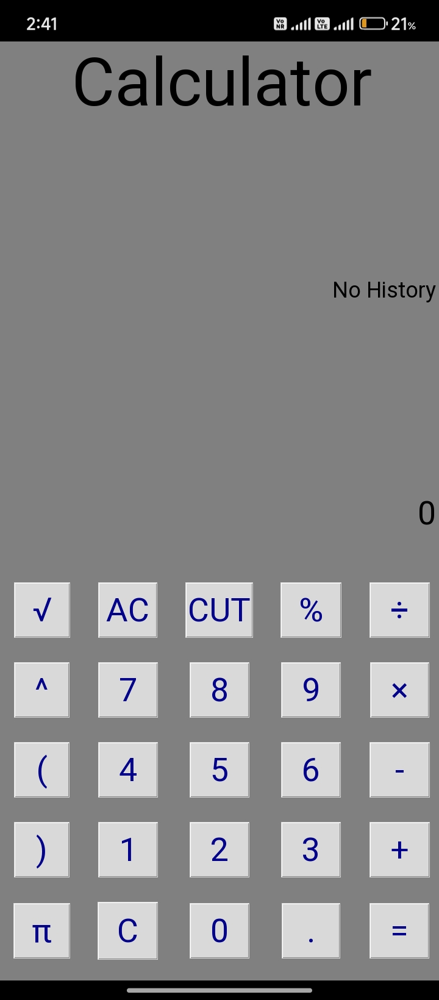

---

# 🧮 GUI Calculator

A full-featured calculator app built with Python and Tkinter, simulating the interface and behavior of a physical calculator.

---

## 📚 Table of Contents
- [Features](#-features)
- [Screenshot](#-screenshot)
- [Tech Stack](#-tech-stack)
- [How to Run](#-how-to-run)
- [Folder Structure](#-folder-structure)
- [License](#-license)
- [Author](#-author)

---

## 🚀 Features
- Basic Arithmetic: `+`, `-`, `×`, `÷`
- Advanced: `√`, `^`, `%`, `π`
- Bracket support
- Full calculation history
- Buttons for: `AC`, `C`, `Cut`
- Responsive UI with modern design

---

## 🖼️ Screenshot



---

## ⚙️ Tech Stack
- Python 3
- Tkinter (GUI Library)

---

## ▶️ How to Run

```bash
python calculator.py
```

---

## 📂 Folder Structure

gui-calculator/
├── calculator.py
├── README.md
├── LICENSE
├── screenshot.jpg

---

## 📄 License

Licensed under the MIT License.  
See [LICENSE](LICENSE) file for full text.

---

## 🙋‍♂️ Author

**Raunak Raj**  
- Class 10 Student | From India 🇮🇳  
- Aspiring Freelancer | Web Developer | Python Programmer  
- [Portfolio Website](https://raunak-raj-2025.github.io)
